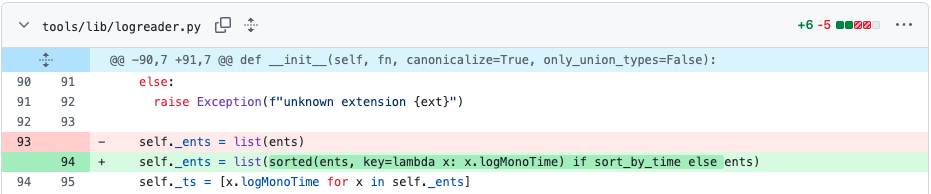

# 用户实验介绍：任务 2

## 实验环境配置

请通过以下命令配置环境，用于测试编辑结果：

```bash
conda create --name env_2 python=3.10 -y
conda activate env_2
pip install pycapnp
pip install pycurl
pip install tenacity
pip install atomicwrites
pip install tqdm
```

## 任务介绍

openpilot 是一个开源的、 L2 级别的驾驶辅助系统，提供包括：自适应巡航控制、自动车道居中 等功能。

openpilot 在 `tools/lib/logreader.py` 中定义了类 `LogReader`，该类的实例负责从 log 文件中读取数据。

当前的实现当中，读取 log 的顺序是文件中的原始存储顺序。但是在多线程和异步写入的场景下，这种顺序是不可靠的。因此我们希望为类 `LogReader` 新增按照时间读取的功能，如下图所示：


其中 `sort_by_time` 是一个**尚待定义的 `LogReader` 参数**。

你可以前往 [`tools/lib/logreader.py`](tools/lib/logreader.py)，复制以下内容完成该初始修改：

```python
    self._ents = list(sorted(ents, key=lambda x: x.logMonoTime) if sort_by_time else ents)
```

请你在完成该初始修改后，找到所有受到该编辑影响的位置，并完成后续修改。

> ⚠️ **温馨提示**
>
> * **初始编辑包含在内**，一共需要完成 **8** 处修改
>
> * 所有的修改都不需要新增/删除/重命名任何文件
>
> * 你可以在项目根目录下运行 `python count.py` 来查看和统计已经完成的编辑数量
>
> * 编辑数量**仅供参考**，请根据[验证修改](#验证修改)来判断是否完成修改目标

## 编辑描述

当你需要输入编辑描述时，你可以直接复制以下内容：

```bash
LogReader: add arg to sort by time
```

如果你所在的实验组使用的后端模型是 Claude Code，你可以输入任意内容和 Claude Code 沟通。

## 验证修改

请在项目根目录下运行以下命令，验证修改是否成功：

```bash
python -m test.run
```

当修改正确时，你应该看到以下内容：

```bash
Test 1 passed.
Test 2 passed.
Test 3 passed.
Test 4 passed.
```

恭喜你成功完成该任务，你可以告知实验负责人，停止录屏，整理需要提交的内容，并在**所有任务**完成后，打包提交。
